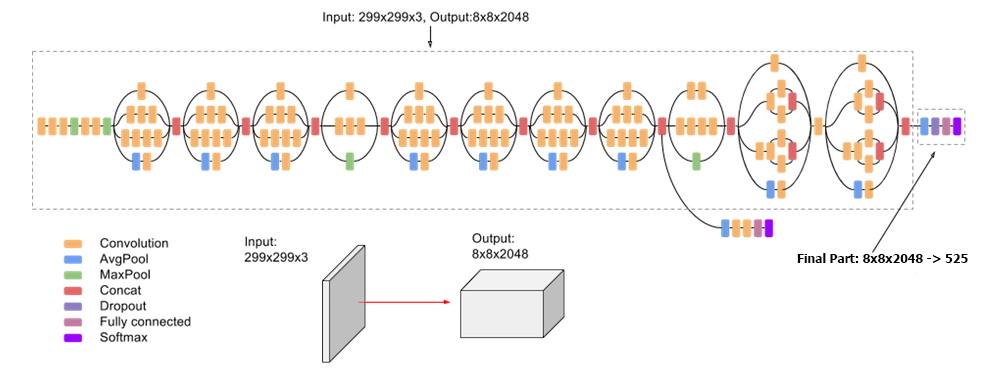
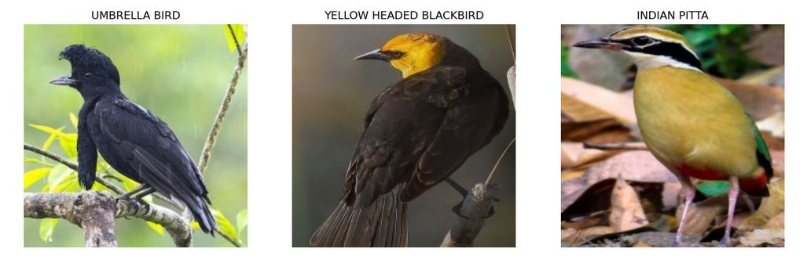
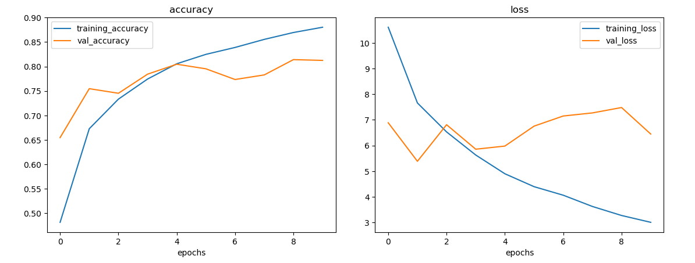
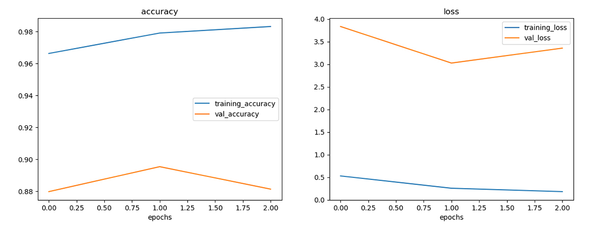

# Bird Species Classification using Inception-v3 Network
## Introduction
The Inception V3 is a deep learning model for image classification that is based on Convolutional Neural Networks (CNNs). The Inception V3 is an improved version of the basic model Inception V1, which was introduced in 2014 as GoogLeNet. It was created by a Google team, as the name implies. In essence, an Inception Network is a deep neural network composed of repeating blocks, with the output of one acting as an input to the next. Inception blocks are defined for each block. The network I've used in this project is following.


## Project Overview
It is basically a transfer learning project where I use Inception-v3 network to extract the classification feature. The dataset I use is "BIRDS 525 SPECIES- IMAGE CLASSIFICATION". This dataset has 525-classes and total 89885-images. All of the images are clean RGB image. In this project I follow several steps to complete the project and obtain better classification result.
- Data Collection and Observation
- Data Preprocessing
- Create the Model and Modify
- Observe the Test result
- Fine Tuning
- Final Result

### Data Collection and Observation
The data is collected from [Kaggle](https://www.kaggle.com/datasets/gpiosenka/100-bird-species). The dataset size is more then 2GB. There are total 89887 images in total and among them 84635 images belonging to 525 classes for training and 2625 images belonging to 525 classes for validation and the rest of 2625 images belonging to 525 classes are for testing. They provide a .csv file which contains all the details about the training, validation and testing data. Lets visualize some images;


### Data Preprocessing
I use ImageDataGenerator and rescale to process the images into new form. As we know original images consist in RGB coefficients in the 0-255 and such values would be too high for any model to process. So the target values between 0 and 1 instead by scaling with a 1/255.

### Create the Model and Modify
tf.keras.applications.InceptionV3() contains the InceptionV3 model. And according to the structure InceptionV3() takes the output as 299x299x3 and gives the 8x8x2048 and the task here is to leave out the final fully connected layer because the number of classes in this experiment is 525. The output of InceptionV3() is fed into the GlobalAveragePooling2D module and then the softmax layer takes place to give the expected output probability of every class. Here the modified model contains 22.87M parameters and among them 1.07M parameters are trainable and the rest of them are non-trainable. In this project, Adam is used as an optimizer and the learning rate was 1e-2 and the loss function I used here is categorical_crossentropyLoss(). The train was performed for 10 epoch.

### Observe the Test result
The test accuracy is =  ```83.20%```<br>

### Fine Tuning
The accuracy is quite low because in this experiment I only changed a little structure from the original InceptionV3() network and only the last layer was trainable. But now try the last 10 layers as trainable. And this is the visualization after tuning is as follows;

### Final Result
The test accuracy after fine-tuning is = ```90.89%``` which is far better than before obtained accuracy. There are more ways to fine-tune the model that will improve the accuracy more.
